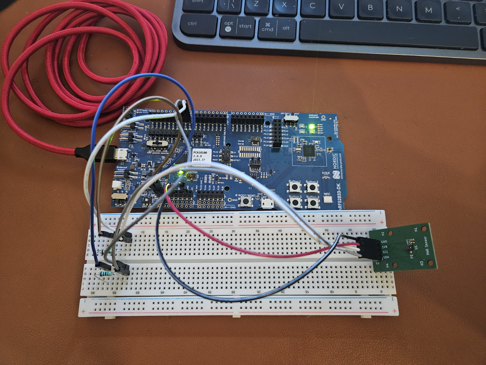

# nRF52833 + AS7341 Low-Power Spectral Sensing

> Low-power firmware for the nRF52833 DK interfacing with the AS7341 11-channel spectral sensor over I2C. Designed for outdoor PAR (Photosynthetically Active Radiation) monitoring, Lux measurement, and spectral analysis.



---

## 🔧 Hardware

| | |
|---|---|
| **MCU** | nRF52833 DK (PCA10100) |
| **Sensor** | AS7341 11-channel spectral sensor (AMS) |
| **Interface** | I2C / TWI at 400 kHz, 3.3 V logic |

### 📌 I2C Pin Assignment

| Signal | Pin |
|--------|-----|
| SDA | **P0.19** |
| SCL | **P0.17** |

> ⚠️ **External pull-up resistors are required** on both SDA and SCL lines.
> The firmware disables the nRF52833 internal pull-ups after TWI init to avoid conflict. Recommended: 4.7 kΩ to 3.3 V.

---

## 📡 Sensor Configuration

| Parameter | Value |
|-----------|-------|
| Gain | `AS7341_GAIN_1X` |
| ATIME | 35 |
| ASTEP | 999 |
| Integration time | ~100 ms |
| Channels | F1 (415 nm) to F8 (680 nm), Clear, NIR |

Integration time formula:
```
t_int = (ATIME + 1) x (ASTEP + 1) x 2.78 us
      = 36 x 1000 x 2.78 us ~ 100 ms
```

### 🔀 Measurement Sequence

The AS7341 uses two SMUX passes per sample (6 ADC channels, 10 spectral channels):

| Pass | Channels |
|------|----------|
| Pass 1 | F1, F2, F3, F4, Clear, NIR |
| Pass 2 | F5, F6, F7, F8, Clear, NIR |

### 📊 Computed Outputs

| Output | Description |
|--------|-------------|
| **PAR** | Photosynthetically Active Radiation (umol/m^2/s) via regression across spectral bands |
| **Lux** | Illuminance using CIE photopic luminosity weights |

---

## 🔋 Low Power Strategy

1. DCDC converter enabled (`NRF_POWER->DCDCEN = 1`)
2. RTC2 for 1-second periodic wake-ups (32 Hz LFCLK — lower power than TIMER)
3. `nrf_pwr_mgmt_run()` in main loop puts the CPU to sleep between events

---

## 💻 Software Setup

| Item | Details |
|------|---------|
| SDK | Nordic nRF5 SDK 17.1.0 |
| Toolchain | SEGGER Embedded Studio for ARM (v5.42a or later) |
| SoftDevice | Not required |
| Logging | SEGGER RTT via J-Link (on-board) |

### 🚀 Getting Started

1. Copy the project folder into:
   ```
   nRF5_SDK_17.1.0_ddde560/examples/peripheral/
   ```
2. Open the `.emProject` file in `pca10100/blank/ses/`
3. Click **Build and Debug** (F5) — RTT output is only visible with the debugger attached
4. Open the **Debug Terminal** tab in SES to see log output

> 💡 Do **not** just flash and run — RTT requires an active debug session to display messages.

---

## 📁 Directory Structure

```
nRF52833-I2C-AS7341-Low-Power-Spectral-Sensing/
├── main.c                        # App entry: RTC, sensor init, main loop
├── drivers/
│   ├── as7341/
│   │   ├── as7341.c              # Sensor driver
│   │   ├── as7341.h              # Driver API
│   │   └── as7341_defines.h      # Register map, enums, bit masks
│   └── i2c/
│       ├── i2c_interface.c       # TWI abstraction (nrf_drv_twi)
│       └── i2c_interface.h       # I2C API
├── pca10100/blank/ses/
│   └── *.emProject               # SEGGER Embedded Studio project
├── sdk_config.h                  # nRF5 SDK configuration
└── AS7341/                       # Datasheet (PDF)
```

---

## 📸 Example Output

**RTT Log**


**Power Consumption Profile** (Nordic PPK2)


---

## 🛠 Troubleshooting

| Symptom | Likely Cause | Fix |
|---------|-------------|-----|
| `ANACK` on first transaction | Sensor VDD not ready | Verify 3.3 V is present before MCU starts I2C |
| `ANACK` on every transaction | Missing pull-ups | Add 4.7 kΩ pull-ups on SDA/SCL to 3.3 V |
| No RTT output | No debug session | Use Build and Debug, not just flash |
| All channels read 0 | Gain or integration too low | Increase ATIME or GAIN in `as7341_init_sensor()` |
| Channels saturated (65535) | Gain too high | Reduce gain — driver logs a warning on saturation |

---

## 📚 References

- [AS7341 Datasheet – AMS](https://ams.com/as7341)
- [nRF52833 DK – Nordic Semiconductor](https://www.nordicsemi.com/Products/nRF52833)
- [nRF5 SDK 17.1.0 Documentation](https://infocenter.nordicsemi.com/topic/sdk_nrf5_v17.1.0/index.html)
- Based on: [`nRF52833-I2C-SPI-PCAP04-Low-Power-Capacitive-Sensing`](https://github.com/daskals/nRF52833-I2C-SPI-PCAP04-Low-Power-Capacitive-Sensing)

---

## 📜 License

MIT License
