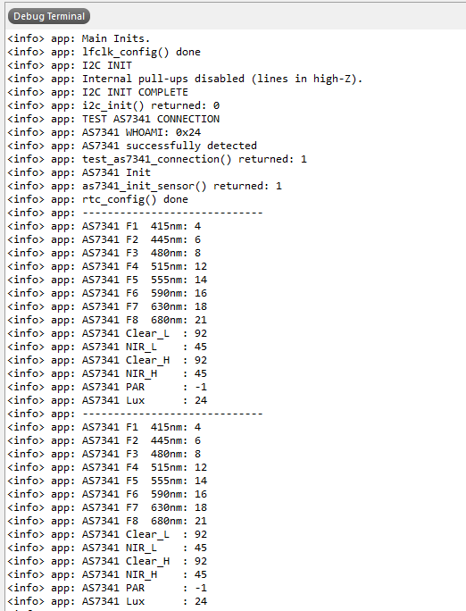
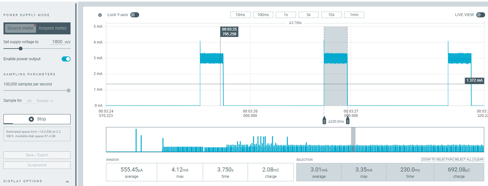

# nRF52833-I2C-AS7341-Low-Power-Spectral-Sensing

Low-power firmware for Nordic Semiconductor's nRF52833 DK to interface with the AS7341 multi-channel spectral sensor over I2C. Designed for outdoor applications such as PAR (Photosynthetically Active Radiation) monitoring, Lux measurement, and spectral analysis.

## Hardware

- **MCU**: nRF52833 DK (PCA10100)
- **Sensor**: AS7341 11-channel spectral sensor (AMS)
- **Interface**: I2C / TWI at 400 kHz (3.3 V logic)
- **Use Case**: Outdoor spectral measurement, PAR and Lux sensing

### I2C Pin Assignment

| Signal | nRF52833 Pin |
|--------|-------------|
| SDA    | **P0.19**   |
| SCL    | **P0.17**   |

> **External pull-up resistors are required on both SDA and SCL lines.**
> The firmware explicitly disables the nRF52833 internal pull-ups after TWI init so they do not conflict with the external resistors. Typical values: 4.7 kΩ to 3.3 V for 400 kHz operation.

## Sensor Configuration

| Parameter | Value |
|-----------|-------|
| Gain      | `AS7341_GAIN_1X` |
| ATIME     | 35 |
| ASTEP     | 999 |
| Integration time | ~100 ms |
| Channels  | F1 (415 nm) – F8 (680 nm), Clear, NIR |

### Integration Time Formula

```
t_int = (ATIME + 1) × (ASTEP + 1) × 2.78 µs
      = 36 × 1000 × 2.78 µs ≈ 100 ms
```

### Measurement Sequence

The AS7341 has 6 ADC channels but 10 spectral channels. Two SMUX passes are used per sample:

1. **Pass 1** — routes F1–F4, Clear, NIR → ADC channels 0–5
2. **Pass 2** — routes F5–F8, Clear, NIR → ADC channels 0–5

Both passes are triggered automatically by `as7341_read_all_channels()`, which returns 12 values: `[F1, F2, F3, F4, Clear0, NIR0, F5, F6, F7, F8, Clear, NIR]`.

### Computed Outputs

| Output | Description |
|--------|-------------|
| PAR    | Photosynthetically Active Radiation (µmol/m²/s), regression coefficients across spectral bands |
| Lux    | Illuminance using CIE photopic luminosity weights |

## Low Power Strategy

1. DCDC converter enabled (`NRF_POWER->DCDCEN = 1`)
2. RTC2 used for 1-second periodic wake-ups (32 Hz LFCLK, lower power than TIMER)
3. `nrf_pwr_mgmt_run()` in main loop → WFE between events

## Software Setup

| Item | Details |
|------|---------|
| SDK  | Nordic nRF5 SDK 17.1.0 |
| Toolchain | SEGGER Embedded Studio for ARM (v5.42a or later) |
| SoftDevice | Not required |
| Logging | SEGGER RTT (J-Link on-board) |

### Getting Started

1. Copy the project folder into:
   ```
   nRF5_SDK_17.1.0_ddde560/examples/peripheral/
   ```
2. Open the `.emProject` file in:
   ```
   pca10100/blank/ses/
   ```
3. **Build and Debug** (F5 in SES) — do **not** just flash and run. RTT output is only visible when the debugger is attached.
4. Open the **Debug Terminal** tab (or use SEGGER J-Link RTT Viewer) to see log output.

> RTT messages will not appear if you flash without the debugger attached. Always use **Build → Debug** to start a debug session and view the output.

### Expected Startup Log

```
Main Inits.
lfclk_config() done
I2C INIT
I2C INIT COMPLETE
AS7341 successfully detected
AS7341 initialized
rtc_config() done
```

Then every 1 second:
```
-----------------------------
AS7341 F1  415nm: NNN
AS7341 F2  445nm: NNN
AS7341 F3  480nm: NNN
AS7341 F4  515nm: NNN
AS7341 F5  555nm: NNN
AS7341 F6  590nm: NNN
AS7341 F7  630nm: NNN
AS7341 F8  680nm: NNN
AS7341 Clear_L  : NNN
AS7341 NIR_L    : NNN
AS7341 Clear_H  : NNN
AS7341 NIR_H    : NNN
AS7341 PAR      : NNN
AS7341 Lux      : NNN
```

## Directory Structure

```
nRF52833-I2C-AS7341-Low-Power-Spectral-Sensing/
├── main.c                            # App entry point: RTC, sensor init, main loop
├── drivers/
│   ├── as7341/
│   │   ├── as7341.c                  # Sensor driver implementation
│   │   ├── as7341.h                  # Driver API
│   │   └── as7341_defines.h          # Register map, enums, bit masks
│   └── i2c/
│       ├── i2c_interface.c           # TWI abstraction (nRF SDK nrf_drv_twi)
│       └── i2c_interface.h           # I2C API
├── pca10100/blank/ses/
│   └── as7341_pca10100.emProject     # SEGGER Embedded Studio project file
├── sdk_config.h                      # nRF5 SDK peripheral configuration
└── AS7341/                           # AS7341 datasheet (PDF)
```

## Example Output

### RTT Log



### Power Consumption Profile

Captured with Nordic PPK2:



## Troubleshooting

| Symptom | Likely Cause | Fix |
|---------|-------------|-----|
| `ANACK` error on I2C | Sensor not powered or not ready | Check sensor VDD; verify 3.3 V is present before the MCU starts I2C |
| `ANACK` on every transaction | Missing pull-up resistors | Add external 4.7 kΩ pull-ups on SDA/SCL to 3.3 V |
| No RTT output | Debug session not started | Use Build → Debug, not just flash/run |
| All channel readings are 0 | Integration time too short or gain too low | Increase ATIME or GAIN in `as7341_init_sensor()` |
| Saturated readings (65535) | Gain too high | Reduce gain in `as7341_init_sensor()` — driver logs a warning when saturation is detected |

## References

- [AS7341 Datasheet – AMS](https://ams.com/as7341)
- [nRF52833 DK – Nordic Semiconductor](https://www.nordicsemi.com/Products/nRF52833)
- [nRF5 SDK 17.1.0 Documentation](https://infocenter.nordicsemi.com/topic/sdk_nrf5_v17.1.0/index.html)
- Based on: [`nRF52833-I2C-SPI-PCAP04-Low-Power-Capacitive-Sensing`](https://github.com/daskals/nRF52833-I2C-SPI-PCAP04-Low-Power-Capacitive-Sensing)

## License

MIT License
